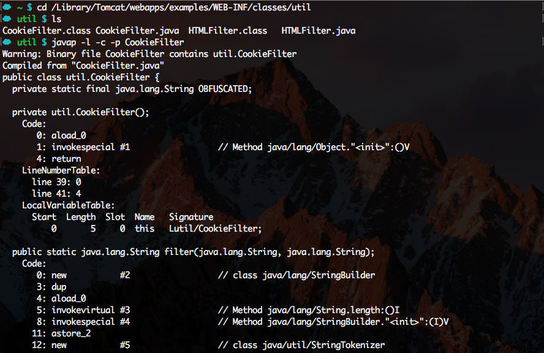
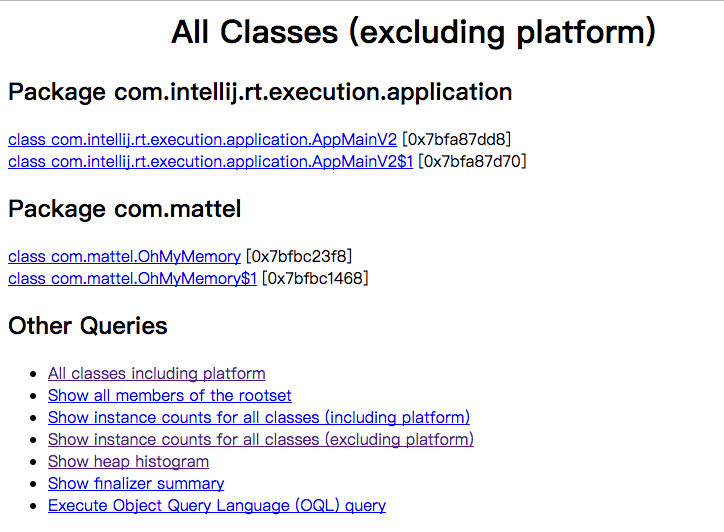
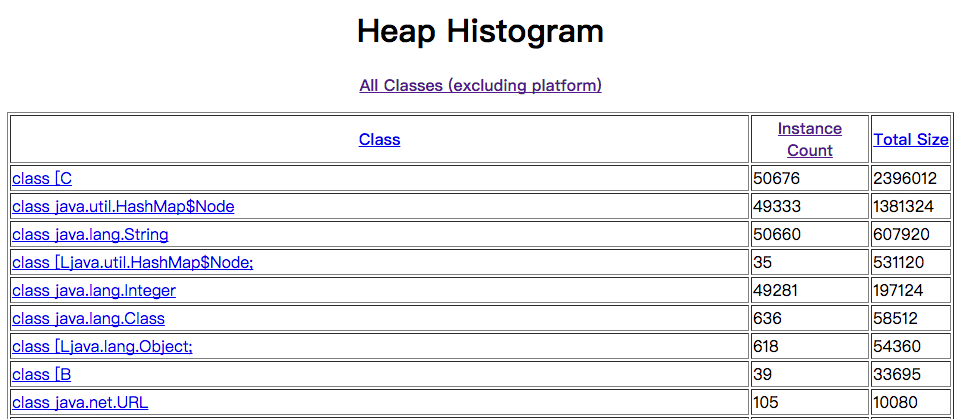

# JDK Tools and Utilities
I will introduce some performance related tools in the follow.

## Warm up
Have you ever looked at what tools are bundled with your JDK installation? There ought to be something useful in there, right, since someone allegedly smart agreed to bundle it in ;-). Let's take a look!

```
$ cd $JAVA_HOME
$ ls bin
appletviewer   javadoc        jdb            jps            keytool        rmiregistry    wsimport
extcheck       javafxpackager jdeps          jrunscript     native2ascii   schemagen      xjc
idlj           javah          jhat           jsadebugd      orbd           serialver
jar            javap          jinfo          jstack         pack200        servertool
jarsigner      javapackager   jjs            jstat          policytool     tnameserv
java           jcmd           jmap           jstatd         rmic           unpack200
javac          jconsole       jmc            jvisualvm      rmid           wsgen
```

Now, just to reiterate, below is not a full list of JDK tools, but we want to give you some useful tools for performance monitoring. Here are examples of what actually useful things can you do with these commands.

- [javap](#1-javap)
- [jhalt](#2-jhalt)
- [jmap](#3-jmap)
- [jps](#4-jps)
- [jstack](#5-jstack)
- [jstat](#6-jstat)
- [jinfo](#7-jinfo)

---
## 1. javap
The most useful variation of flags that you can pass to the javap – the Java Class Disassembler is the following:

* -l: print line and local variable
* -p: print information about non-public items as well
* -c: print method bytecode

For example in the famous “Do you really get Classloaders?” presentation, when an NoSuchMethodException occurs, we investigate what members the class actually has, we execute:

```
$ javap -l -c -p {className}
```

and get all the info about the class we're looking for.



## 2. jhalt
The Java Heap Analysis Tool (jhat) and is used exactly how it's described: analysing heap dumps. In our small example, we'll generate that by causing an OutOfMemoryError and supplying a `-XX:+HeapDumpOnOutOfMemoryError` option of the Java process, so it will produce a file for us to analyze. Also see `-XX:HeapDumpPath=<path>.` Sets the directory path to where a heap dump file is created to the path specified as <path>. Useful when wanting to direct the generation of a heap dump file to a specific directory location.

This is an example to cause an OutOfMemoryError. We set the maximum heap size by passing `-Xmx8m` (where 8 is the number of megabytes) to JVM:

```java
public class OhMyMemory1 {

    private static Map<String, Integer> map = new HashMap<>();

    public static void main(String[] args) throws Exception {
        // Get current size of heap in bytes
        long heapSize = Runtime.getRuntime().totalMemory();
        System.out.println("heapSize: " + String.valueOf(heapSize));
        Runtime.getRuntime().addShutdownHook(
                new Thread() {
                    @Override
                    public void run() {
                        System.out.println("We have accumulated " + map.size() + " entries");
                    }
                }
        );
        for(int i = 0; ;i++) {
            map.put(Integer.toBinaryString(i), i);
        }
    }
}
```

When we run this snippet, it produces the following output:

```java
heapSize: 7864320
java.lang.OutOfMemoryError: Java heap space
Dumping heap to java_pid91125.hprof ...
Exception in thread "main" java.lang.OutOfMemoryError: Java heap space
	at java.util.HashMap.resize(HashMap.java:703)
	at java.util.HashMap.putVal(HashMap.java:662)
	at java.util.HashMap.put(HashMap.java:611)
	at com.mattel.OhMyMemory.main(OhMyMemory.java:23)
Heap dump file created [9862810 bytes in 0.141 secs]
We have accumulated 49153 entries
```

Great success, we have a file now.(`java_pidxxxxx.hprof`) Let's aim `jhat` at it and start the analysis. It crunches the file and spins off a http server for us to get the results.

```
$ cd ~/jvm-tool-survey/example/OhMyMemory
$ jhat java_pid91125.hprof
Reading from java_pid91125.hprof...
Dump file created Wed May 17 15:55:06 CST 2017
Snapshot read, resolving...
Resolving 203499 objects...
Chasing references, expect 40 dots........................................
Eliminating duplicate references........................................
Snapshot resolved.
Started HTTP server on port 7000
Server is ready.
```

Visiting http://localhost:7000 reveals the webpage with links to the data.



And from there we can look at, for example, the Heap Histogram to figure out what is eating our memory.



Now it's clear that our HashMap with 49333 nodes is what crashes the program.

## 3. jmap
Jmap is a memory mapping tool that provides another way to obtain heap dumps without the need to cause any OutOfMemoryErrors. Let's change the above program a bit to show that in action.

```java
public class OhMyMemory2 {
    private static Map<String, Integer> map = new HashMap<>();

    public static void main(String[] args) throws Exception {
        // Get current size of heap in bytes
        long heapSize = Runtime.getRuntime().totalMemory();
        System.out.println("heapSize: " + String.valueOf(heapSize));
        Runtime.getRuntime().addShutdownHook(
                new Thread() {
                    @Override
                    public void run() {
                        System.out.println("Enter something, so I'll release the process");
                        try {
                            System.in.read();
                        } catch (IOException e) {
                            e.printStackTrace();
                        }
                        System.out.println("We have accumulated " + map.size() + " entries");
                    }
                }
        );
        for(int i = 0;i < 10000 ;i++) {
            map.put(Integer.toBinaryString(i), i);
        }
    }
}
```

Note: We don't consume a amount of memory, but finish early and not allowing the JVM to exit. This allows us to connect to this program's process with jmap and get the precious memory dump.

We can use jps to locate the java process and get the pid.

```
$ jps -V
94514 Jps
94493 OhMyMemory2
1213 Bootstrap
$ jmap -heap 94493
Attaching to process ID 94493, please wait...
Debugger attached successfully.
Server compiler detected.
JVM version is 25.121-b13

using thread-local object allocation.
Parallel GC with 4 thread(s)

Heap Configuration:
   MinHeapFreeRatio         = 0
   MaxHeapFreeRatio         = 100
   MaxHeapSize              = 134217728 (128.0MB)
   NewSize                  = 44564480 (42.5MB)
   MaxNewSize               = 44564480 (42.5MB)
   OldSize                  = 89653248 (85.5MB)
   NewRatio                 = 2
   SurvivorRatio            = 8
   MetaspaceSize            = 21807104 (20.796875MB)
   CompressedClassSpaceSize = 1073741824 (1024.0MB)
   MaxMetaspaceSize         = 17592186044415 MB
   G1HeapRegionSize         = 0 (0.0MB)

Heap Usage:
PS Young Generation
Eden Space:
   capacity = 34078720 (32.5MB)
   used     = 5457128 (5.204322814941406MB)
   free     = 28621592 (27.295677185058594MB)
   16.01330096905048% used
From Space:
   capacity = 5242880 (5.0MB)
   used     = 0 (0.0MB)
   free     = 5242880 (5.0MB)
   0.0% used
To Space:
   capacity = 5242880 (5.0MB)
   used     = 0 (0.0MB)
   free     = 5242880 (5.0MB)
   0.0% used
PS Old Generation
   capacity = 89653248 (85.5MB)
   used     = 0 (0.0MB)
   free     = 89653248 (85.5MB)
   0.0% used

925 interned Strings occupying 62576 bytes.
```

Also it might be easier just to trigger the dump and analyze that later at your leisure. To do that, pass the *-dump* flag to jmap, like in the example below:

```
$ jmap -dump:live,format=b,file=heap.bin 95137
Dumping heap to /Users/colacheng/Desktop/jvm-tool-survey/example/OhMyMemory/heap.bin ...
Heap dump file created
```

Now you have the dump file *heap.bin*, which you can feed to a memory analyzer of your choosing.

## 4. jps
Jps is a process status tool that is most commonly used to determine process ID (PID) of the Java process. It works in an OS-independent way and is really convenient. Imagine that we have started the program above and want to connect to it with jmap. For that we need a PID and that is the exact scenario where jps comes to the rescue.

```
$ jps -mlv
95137 com.mattel.OhMyMemory2 -XX:+HeapDumpOnOutOfMemoryError -Xmx128m -javaagent:/Applications/IntelliJ IDEA CE.app/Contents/lib/idea_rt.jar=55836:/Applications/IntelliJ IDEA CE.app/Contents/bin -Dfile.encoding=UTF-8
.
.
.
```

We find that the combination of flags *"-mlv"* works the best in most cases. It print out main method args, full package names and arguments given to the JVM. This makes quite easy to identify the process you need even among similar ones.

## 5. jstack
Jstack is a utility to produce threads' stacktraces of a given JVM process. If you think there is a deadlock and just want to verify what your threads do while you're shown that progress bar, jstack is for you.

Every block description:

```
First line: $1-Thread name $2-Priority $3-Thread ID $4-Native thread ID $5-Status $6-Thread address
Second line: Thread status
Third line: Detailed description
```

```
$ jstack 12457
2017-05-18 10:44:38
Full thread dump Java HotSpot(TM) 64-Bit Server VM (25.121-b13 mixed mode):

"Attach Listener" #12 daemon prio=9 os_prio=31 tid=0x00007fb75a000000 nid=0x1007 waiting on condition [0x0000000000000000]
   java.lang.Thread.State: RUNNABLE

"Thread-0" #10 prio=5 os_prio=31 tid=0x00007fb75a854000 nid=0x5003 runnable [0x000070000a36d000]
   java.lang.Thread.State: RUNNABLE
	at java.io.FileInputStream.readBytes(Native Method)
	at java.io.FileInputStream.read(FileInputStream.java:255)
	at java.io.BufferedInputStream.fill(BufferedInputStream.java:246)
	at java.io.BufferedInputStream.read(BufferedInputStream.java:265)
	- locked <0x00000007bd59e188> (a java.io.BufferedInputStream)
	at com.mattel.OhMyMemory2$1.run(OhMyMemory2.java:20)
.
.
.
"VM Thread" os_prio=31 tid=0x00007fb75a014000 nid=0x2d03 runnable

"GC task thread#0 (ParallelGC)" os_prio=31 tid=0x00007fb75b803000 nid=0x2503 runnable

"GC task thread#1 (ParallelGC)" os_prio=31 tid=0x00007fb75b001800 nid=0x2703 runnable

"GC task thread#2 (ParallelGC)" os_prio=31 tid=0x00007fb75b002000 nid=0x2903 runnable

"GC task thread#3 (ParallelGC)" os_prio=31 tid=0x00007fb75b809000 nid=0x2b03 runnable

"VM Periodic Task Thread" os_prio=31 tid=0x00007fb75b0b0800 nid=0x4e03 waiting on condition

JNI global references: 22
```

There are just a couple of options that jstack can accept, so when you're in doubt throw all of them in. Later you can always limit the output, when you can see what information is less useful.

Useful options include **-F to force the dump**, which can be used on hang processes, **-l to print info** about **synchronisation** and **deadlocks**.

```
$ jstack -F -l 95137
Attaching to process ID 95137, please wait...
Debugger attached successfully.
Server compiler detected.
JVM version is 25.121-b13
Deadlock Detection:

No deadlocks found.

Thread 4871: (state = BLOCKED)

Locked ownable synchronizers:
    - None

Thread 20227: (state = IN_NATIVE)
 - java.io.FileInputStream.readBytes(byte[], int, int) @bci=0 (Interpreted frame)
 - java.io.FileInputStream.read(byte[], int, int) @bci=4, line=255 (Interpreted frame)
 - java.io.BufferedInputStream.fill() @bci=214, line=246 (Interpreted frame)
 - java.io.BufferedInputStream.read() @bci=12, line=265 (Interpreted frame)
 - com.mattel.OhMyMemory2$1.run() @bci=11, line=20 (Interpreted frame)

Locked ownable synchronizers:
    - None

Thread 7171: (state = BLOCKED)
 - java.lang.Object.wait(long) @bci=0 (Interpreted frame)
 - java.lang.Thread.join(long) @bci=38, line=1249 (Interpreted frame)
 - java.lang.Thread.join() @bci=2, line=1323 (Interpreted frame)
 - java.lang.ApplicationShutdownHooks.runHooks() @bci=86, line=106 (Interpreted frame)
 - java.lang.ApplicationShutdownHooks$1.run() @bci=0, line=46 (Interpreted frame)
 - java.lang.Shutdown.runHooks() @bci=39, line=123 (Interpreted frame)
 - java.lang.Shutdown.sequence() @bci=26, line=167 (Interpreted frame)
 - java.lang.Shutdown.shutdown() @bci=58, line=234 (Interpreted frame)
.
.
.
```

If you want to find the java process issue like cpu usage abnormally, you can do like following and observe the process detail information:

```
$ jps -v //located java process
$ top -Hp [pid] //located java thread, but osx can't use it. Instead of: sudo dtruss -ap [pid]
$ printf "%x\n" [nid] //convert process id to hexadecimal
$ jstack pid
Located the nid to gain the which thread status.
```

Anyway, if you don't mind exploring the threads as a root, you can use dtruss, which is primarily for processing syscall details, but it will at least show you the TIDs in the PID/LWPID (PID/THRD) column.

## 6. jstat
The jstat utility can be used to gather a variety of different statistics. jstat statistics are sorted into "options" that are specified at the command-line as the first parameter. You can view the list of options available by running jstat with the command **-options**. Some options are shown in Listing:

* -class: 	Statistics on the behavior of the class loader.
* -compiler: Statistics of the behavior of the HotSpot Just-in-Time compiler.
* -gc: Statistics of the behavior of the garbage collected heap.
* -gccapacity: Statistics of the capacities of the generations and their corresponding spaces.
* -gccause: Summary of garbage collection statistics (same as -gcutil), with the cause of the last and current (if applicable) garbage collection events.
* -gcnew: Statistics of the behavior of the new generation.
* -gcnewcapacity: Statistics of the sizes of the new generations and its corresponding spaces.
* -gcold: Statistics of the behavior of the old and permanent generations.
* -gcoldcapacity: Statistics of the sizes of the old generation.
* -gcpermcapacity: Statistics of the sizes of the permanent generation.
* -gcutil: Summary of garbage collection statistics.
* -printcompilation: HotSpot compilation method statistics.

If 12457 were the VMID for a running process started a few minutes ago, then the following command would tell jstat to produce a gc snapshot dump every 250 milliseconds for 2 iterations, then quit:

```
$ jstat -gc 12457 250 2
S0C    S1C    S0U    S1U      EC       EU        OC         OU       MC     MU    CCSC   CCSU   YGC     YGCT    FGC    FGCT     GCT   
5120.0 5120.0  0.0    0.0   33280.0   7326.4   87552.0      0.0     4480.0 774.4  384.0   75.9       0    0.000   0      0.000    0.000
5120.0 5120.0  0.0    0.0   33280.0   7326.4   87552.0      0.0     4480.0 774.4  384.0   75.9       0    0.000   0      0.000    0.000
```

## 7. jinfo
jinfo prints Java configuration information for a given Java process or core file or a remote debug server. Configuration information includes Java System properties and Java virtual machine command line flags.

```
$ jinfo -flags 12457
Attaching to process ID 12457, please wait...
Debugger attached successfully.
Server compiler detected.
JVM version is 25.121-b13
Non-default VM flags: -XX:CICompilerCount=3 -XX:+HeapDumpOnOutOfMemoryError -XX:InitialHeapSize=134217728 -XX:MaxHeapSize=134217728 -XX:MaxNewSize=44564480 -XX:MinHeapDeltaBytes=524288 -XX:NewSize=44564480 -XX:OldSize=89653248 -XX:+UseCompressedClassPointers -XX:+UseCompressedOops -XX:+UseFastUnorderedTimeStamps -XX:+UseParallelGC
Command line:  -XX:+HeapDumpOnOutOfMemoryError -Xmx128m -javaagent:/Applications/IntelliJ IDEA CE.app/Contents/lib/idea_rt.jar=56892:/Applications/IntelliJ IDEA CE.app/Contents/bin -Dfile.encoding=UTF-8
```

---
## References

* <http://docs.oracle.com/javase/6/docs/technotes/tools/index.html?cm_mc_uid=72725953365014943931280&cm_mc_sid_50200000=1495076178>
* <https://zeroturnaround.com/rebellabs/the-6-built-in-jdk-tools-the-average-developer-should-learn-to-use-more/>
* <https://www.ibm.com/developerworks/library/j-5things8/>
* <https://dzone.com/articles/how-analyze-java-thread-dumps>
* <http://www.blogjava.net/jzone/articles/303979.html>
* <http://www.jianshu.com/p/001c823ff111>
* <http://zheng12tian.iteye.com/blog/1420508>
* <http://blog.csdn.net/fenglibing/article/details/6411924>
* <http://stackoverflow.com/questions/28047653/osx-how-can-i-see-the-tid-of-all-threads-from-my-process>
